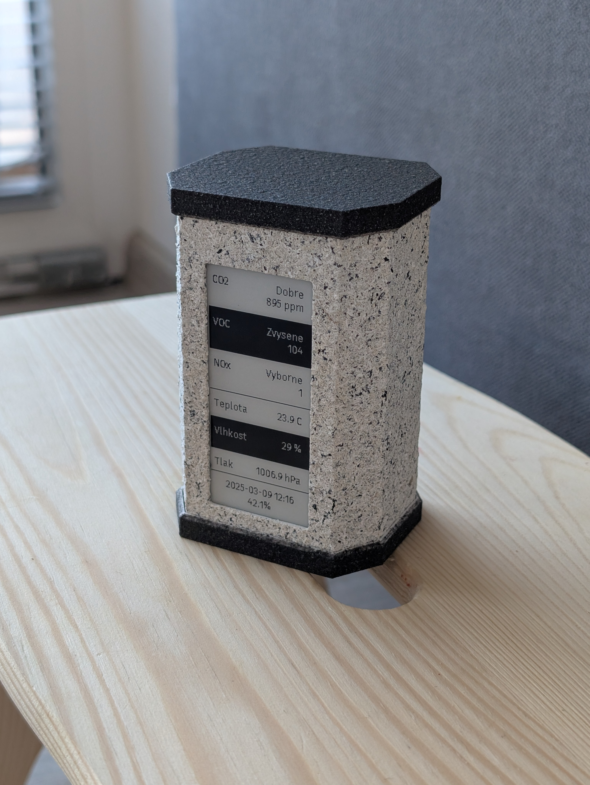
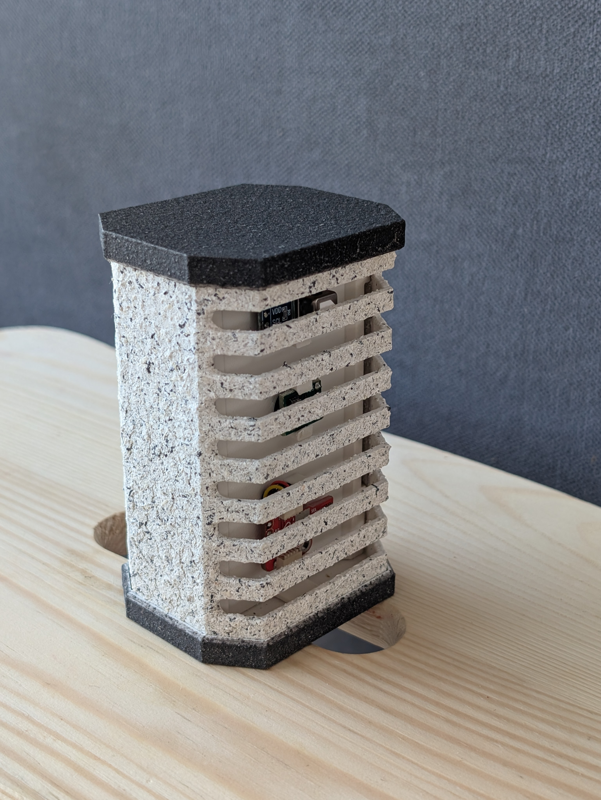
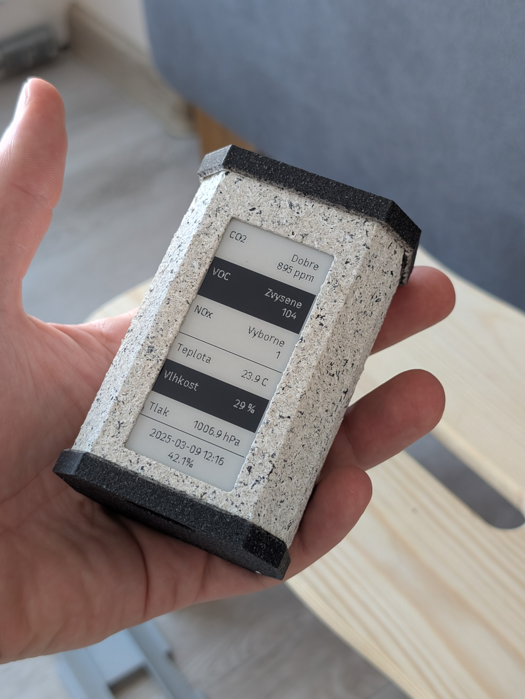
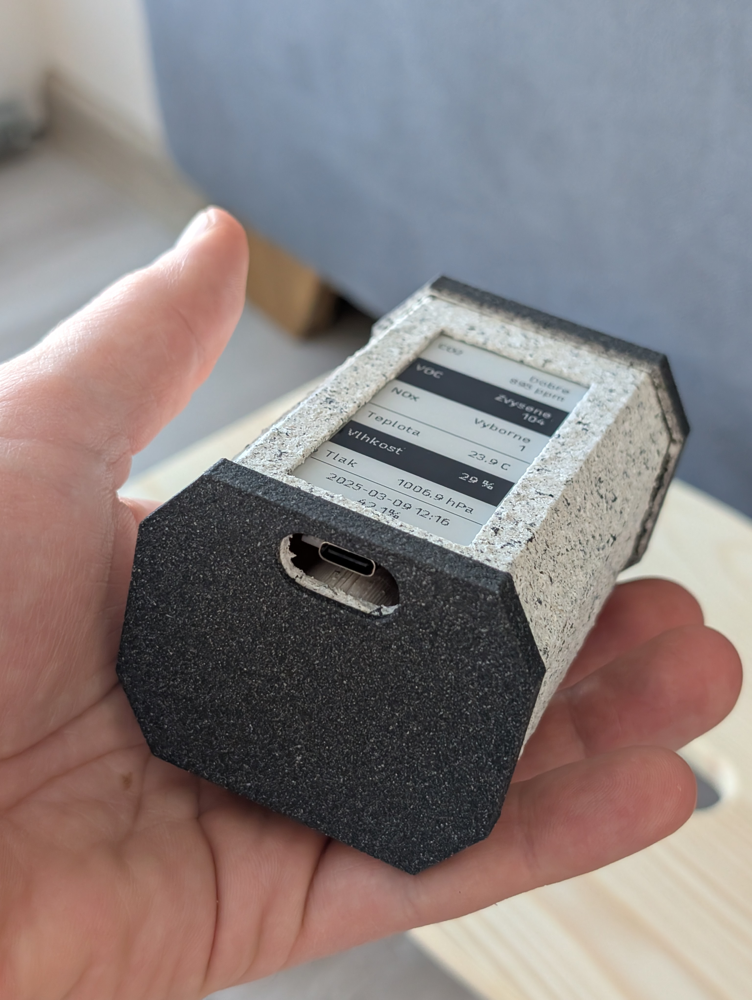
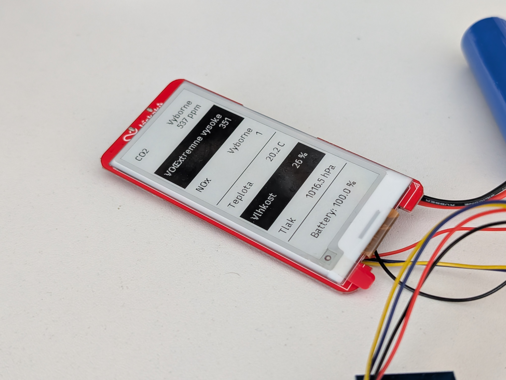
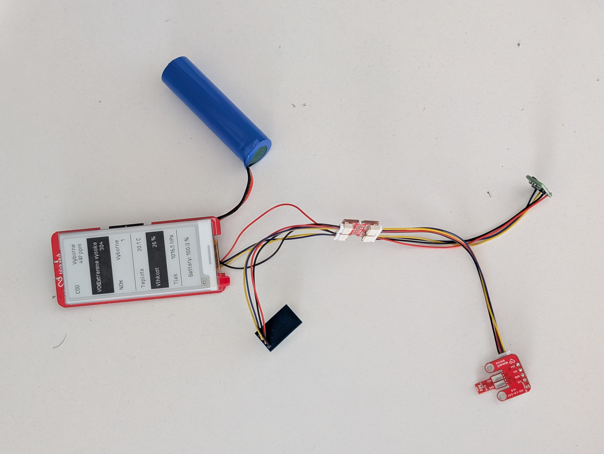
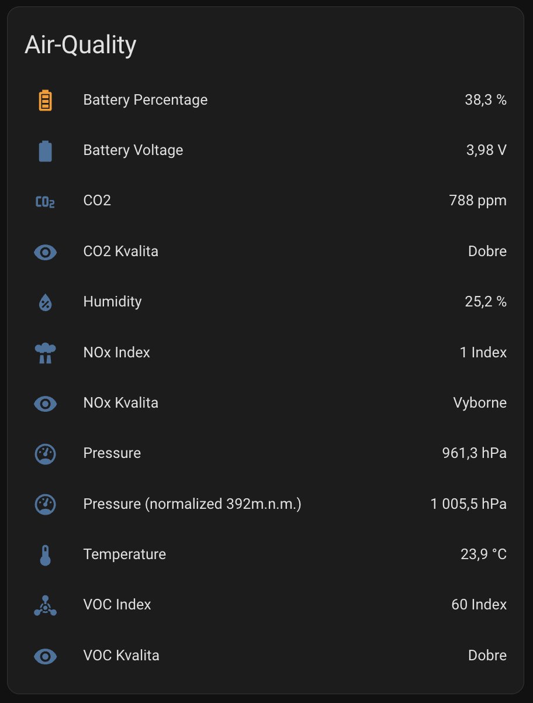
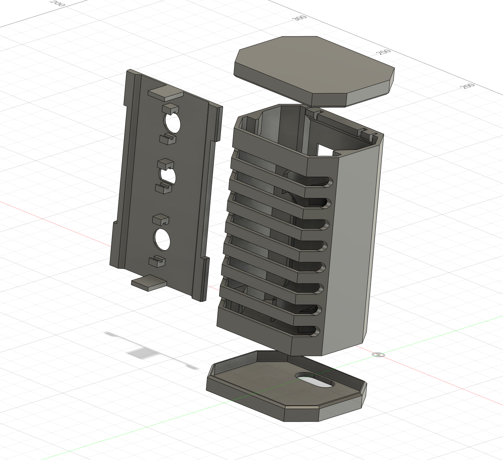

# ESPHome Air Quality Station
ESPHome-powered portable air quality station with HomeAssistant integration

  
  
  
  

  
  
  

## HW parts

### Co2 sensor + temperature + humidity
Czech shop (with easy connection by uSup) [https://www.laskakit.cz/laskakit-scd41-senzor-co2--teploty-a-vlhkosti-vzduchu/](https://www.laskakit.cz/laskakit-scd41-senzor-co2--teploty-a-vlhkosti-vzduchu/)

Better price but long delivery: [https://www.aliexpress.com/item/1005006619366785.html](https://www.aliexpress.com/item/1005006619366785.html)

_* from aliexpress select correct one_

### VOX / nOX
Czech shop (with easy connection by uSup): [https://www.laskakit.cz/laskakit-sgp41-voc-a-nox-senzor-kvality-ovzdusi/](https://www.laskakit.cz/laskakit-sgp41-voc-a-nox-senzor-kvality-ovzdusi/)

Better price but long delivery: [https://www.aliexpress.com/item/1005006749215421.html](https://www.aliexpress.com/item/1005006749215421.html)

_* from aliexpress select correct one_

### Pressure, temperature, humidity
Czech shop (with easy connection by uSup): [https://www.laskakit.cz/arduino-senzor-tlaku--teploty-a-vlhkosti-bme280/](https://www.laskakit.cz/arduino-senzor-tlaku--teploty-a-vlhkosti-bme280/)

Better price but long delivery: [https://www.aliexpress.com/item/1005006995581799.html](https://www.aliexpress.com/item/1005006995581799.html)

_* from aliexpress select correct one_

### ESP32 + display
Czech shop (with easy connection by uSup and battery connection): [https://www.laskakit.cz/laskakit-espink-shelf-2-9-esp32-e-paper/](https://www.laskakit.cz/laskakit-espink-shelf-2-9-esp32-e-paper/)

### Battery
Czech shop: [https://www.laskakit.cz/geb-li-ion-baterie-1x18650-1s1p-3-7v-3200mah/](https://www.laskakit.cz/geb-li-ion-baterie-1x18650-1s1p-3-7v-3200mah/)

### Cables with onnectors
I2C bridge: [https://www.laskakit.cz/laskakit-sup-4x-na-dip-adapter/](https://www.laskakit.cz/laskakit-sup-4x-na-dip-adapter/)

10cm cable: [https://www.laskakit.cz/--sup--stemma-qt--qwiic-jst-sh-4-pin-kabel-10cm/](https://www.laskakit.cz/--sup--stemma-qt--qwiic-jst-sh-4-pin-kabel-10cm/)

Battery reduction: [https://www.laskakit.cz/jst-ph-2-2mm-do-jst-sh-2-1mm-adapter-pro-baterie--5cm/](https://www.laskakit.cz/jst-ph-2-2mm-do-jst-sh-2-1mm-adapter-pro-baterie--5cm/)

### 3D printed STL files

* body: [download](./stl/co2-body.stl)
* desk: [download](./stl/co2-desk.stl)
* header: [download](./stl/co2-header.stl)
* footer: [download](./stl/co2-footer.stl)

### Post-production for 3D printed parts

* color in spray: [https://www.hornbach.cz/c/barvy-tapety-a-oblozeni-sten/barvy-laky/barvy/barvy-ve-spreji/specialni-efekty-ve-spreji/S12050/](https://www.hornbach.cz/c/barvy-tapety-a-oblozeni-sten/barvy-laky/barvy/barvy-ve-spreji/specialni-efekty-ve-spreji/S12050/)

### ESPHome config

[esp-config.yaml](./esp-config.yaml)

## Interesting

* I couldn't use deep sleep because the VOC sensor needs to collect values continuously
* I used a non-standard I2C - because I needed a perpetual I2C power supply
* I needed to modify the library for ePaper (you can see the link in the code)
* there is an extra sensor for temperature and humidity, because the CO2 sensor generates heat and does not measure properly
* device battery life is about 4 days (without VOC / NOX + deepsleep it would be more than a month)
* the display shows the pressure converted to a specific altitude
* values outside the optimum range are highlighted in black on the display
* if no wifi is available, it stops trying to use it - after reboot (usb-c power connection) it tries to find wifi again
